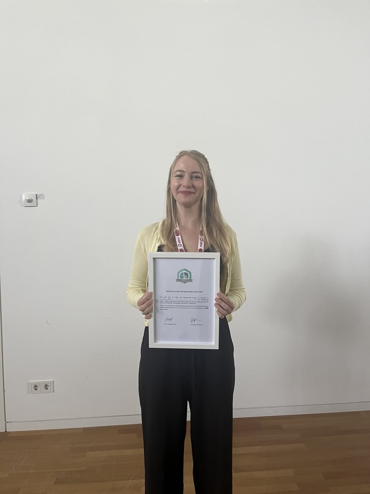
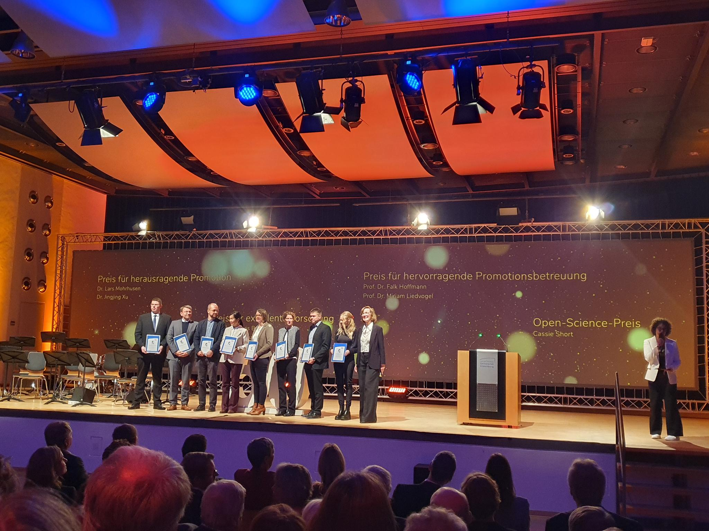

This section highlights academic awards, fellowships, and grant funding received.

**2026 - SIPS Commendation for Contribution to the Event Love Replications Week**
* **Awarding Body:** Society for the Improvement of Psychological Science (SIPS)

**2026 - DFG Individual Research Grant (Eigene Stelle)**
* **Awarding Body:** Deutsche Forschungsgemeinschaft (DFG), Germany
* **Amount:** 360,562 Euros

**2025 - META-REP Small Project Funding**
* **Awarding Body:** DFG SPP META-REP
* **Amount:** 2,000 Euros

**2025 - IGOR Prize for Open and Reproducible Science in Biological Psychology**
* **Awarding Body:** Interest Group for Open and Reproducible Science (IGOR) of the Biological Psychology Section of the German Psychological Association (DGPs)
* **Amount:** 250 Euros

**2024 - META-REP Small Project Funding**
* **Awarding Body:** DFG SPP META-REP
* **Amount:** 2,000 Euros

**2023 - Associate Junior Fellowship Funding Award**
* **Awarding Body:** Hanse-Wissenschaftskolleg, Germany
* **Amount:** 10,000 Euros

**2023 - Open Science Prize for the Open Science Interest Group (co-lead)**
* **Awarding Body:** Universitätsgesellschaft Oldenburg e.V (UGO).
* **Amount:** 1,000 Euros

**2022 - Presidential Office Research Postdoc Funding Award**
* **Awarding Body:** Carl von Ossietzky Universität Oldenburg
* **Amount:** 24-month scholarship, TVL-13 100%

**2022 - Two seminars *nominated* for the Teaching Award**
* **Awarding Body:** University of Hamburg

**2020 - Hamburg Open Science Prize for the CoScience Project** *(one of two responsible postdocs employed to oversee the project)*
* **Awarding Body:** Hamburg Open Science

**2019 - Teaching Award**
* **Awarding Body:** University of Bolton

**2018 - Small Travel Award**
* **Awarding Body:** Ainsworth Funding
* **Amount:** 353 GBP

**2017 - Small Travel Award**
* **Awarding Body:** Ainsworth Fundings
* **Amount:** 485 GBP

**2016 - Ainsworth PhD Scholarship Award**
* **Awarding Body:** Ainsworth Funding 
* **Amount:** Three year PhD scholarship: tuition fees and stipend

**2013 - Higher Education Award**
* **Awarding Body:** Bury College
